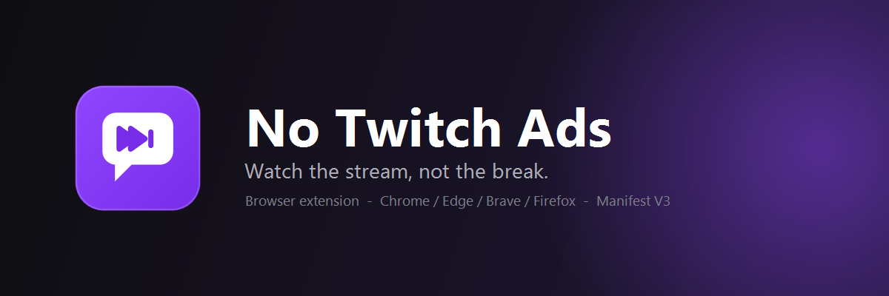
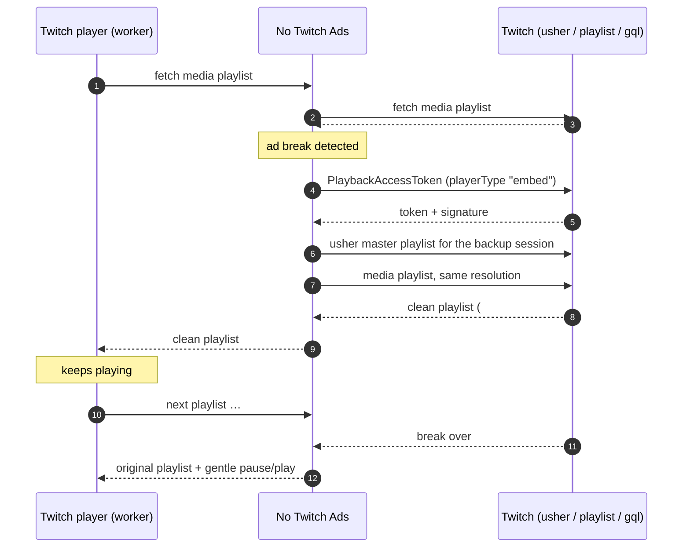
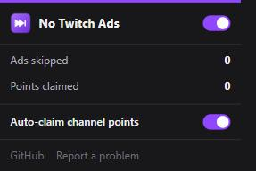

<p align="center">
  
</p>

<p align="center">
  <a href="LICENSE"></a>
  
  
  
  <a href="https://github.com/NobbyBo11ocks/no-twitch-ads/actions/workflows/ci.yml"></a>
</p>

<h3 align="center">Watch the stream, not the break.</h3>

<p align="center">
A browser extension that skips Twitch's server-side video ads on live streams.<br>
No proxies, no third-party servers, no accounts. Every request still goes to Twitch and only to Twitch.
</p>

---

## The problem it solves

Twitch does not serve its video ads as separate requests you can block. Since
"SureStream", ads are **stitched into the same HLS feed as the broadcast on
Twitch's servers**. A conventional blocker that drops the ad request drops the
stream with it, which is why the purple "commercial break in progress" screen
became the normal experience for ad-block users.

No Twitch Ads takes a different route. It watches the playlist the player is
about to consume, recognises the moment a break is stitched in, and for the
length of that break feeds the player a **second, parallel session of the same
stream** that is not inside a break. When the break ends the player snaps back.
From the viewer's side the stream simply keeps playing.

## How it works



In detail:

1. **Early hook.** At `document_start`, in the page's main world, the
   extension wraps `window.Worker`. Twitch's player (Amazon IVS) runs in a
   worker; that worker now boots with a small prelude that wraps its `fetch`.
2. **Playlist inspection.** Every live media playlist the player requests is
   read first. A break is identified by the `twitch-stitched-ad` DATERANGE
   tag. Real segments are tagged `#EXTINF:2.000,live`; ad segments are not
   (a captured one read `#EXTINF:2.000,Amazon|2474283100494`).
3. **Backup session.** During a break the extension asks Twitch's GraphQL for
   a new playback token with the `embed` player type, then `popout`, then the
   360p `autoplay` session, and serves the matching rendition from the first
   one that is clean. The main session's master playlist is cached so a
   player reload does not open a fresh session (and a fresh preroll).
4. **Last resort.** If every backup carries the ad as well, ad segments are
   swapped for a 1 KB blank MP4 and low-latency prefetch hints are removed, so
   nothing is shown rather than an ad.
5. **Quality.** On 2K/4K (HEVC) streams, which backup sessions may not offer,
   the closest AVC rendition is used for the duration of the break.
6. **Housekeeping.** The main stream is requested as a `popout` player (fewer
   prerolls on load), the mini-player-above-chat session is suppressed because
   it plays its own ads, Twitch's "ad in progress" overlays are hidden, the
   player keeps running in background tabs, and a stalled player is nudged.
7. **Channel points.** A mutation observer watches for the bonus button that
   Twitch adds under chat (the `claimable-bonus__icon` element) and clicks it
   for you, so points accrue while you watch.

Everything above was checked against the live site, not just the literature.
`NOTICE.md` lists what was verified and when.

### Measured, not assumed

The backup-session idea only works if those sessions really stay clean while
the main one is in a break. This was measured on 2026-10-01 during a real
midroll on a large channel, polling four parallel sessions every two seconds:

| Session (player type) | During the 212 s break |
| --- | --- |
| `site` (what the normal player uses) | Ad for the full 212 s, a 6-ad pod |
| `embed` (first backup) | Clean for the full 212 s |
| `popout` (second backup) | Clean, except roughly 8 s to 100 s in |
| `autoplay`, 360p (last backup) | Clean for the full 212 s |

That is why the order is `embed` → `popout` → `autoplay`, and why the 360p
fallback is on by default.

## Install

### Chrome, Edge, Brave

1. Download or clone this repository.
2. Open `chrome://extensions` (`edge://extensions`, `brave://extensions`).
3. Turn on **Developer mode** (top right).
4. **Load unpacked** → choose the folder containing `manifest.json`.
5. Reload any open Twitch tab.

### Firefox 128+

1. `npm run build` → produces `dist/firefox/` (Firefox needs an event-page
   background and an add-on id; the manifest is generated).
2. `about:debugging#/runtime/this-firefox` → **Load Temporary Add-on…** →
   `dist/firefox/manifest.json`.

Temporary add-ons are removed when Firefox closes. For a permanent install,
have the zip in `dist/` signed through Mozilla's self-distribution channel, or
use Firefox Developer Edition with `xpinstall.signatures.required` off.

### Before you start

| Do | Don't |
| --- | --- |
| Keep uBlock Origin or similar for banner and sidebar ads. | Run another Twitch video ad blocker at the same time (vaft userscript, the uBlock `twitch-videoad` scriptlet, TTV LOL PRO, Purple AdBlock). Two of them wrapping the player causes freezes. No Twitch Ads detects the common ones and stands down, so remove the other one. |
| Reload Twitch tabs after installing. | Expect it to do anything on VODs or clips. Live streams only. |

If you have Twitch Turbo or a subscription to the channel, Twitch already gives
you an ad-free session and the extension stays idle.

## The popup

<p align="center"></p>

- **Master switch** in the header.
- **Live status** for the current tab: watching, skipping (with the backup in
  use), or blanking.
- **Breaks skipped** and **Points claimed** counters for the tab.
- **Allow ads here** adds the current channel to an allow list, for streamers
  you want to support with ad revenue.
- **Auto-claim channel points**: clicks the "Claim Bonus" button under chat
  as soon as Twitch shows it, after a short randomised delay. On by default.
- **If every backup stream has the ad**: `360p` (default) drops to the 360p
  session so video keeps playing; `Source` never drops quality and blanks the
  ad instead.
- **Request stream as a popout player**: on by default. Turn it off if a
  particular stream refuses to start.
- **Banner** on the player during a break, on or off.

Changes apply immediately, no reload needed.

## Privacy

The extension talks to `twitch.tv`, `gql.twitch.tv`, `usher.ttvnw.net` and the
`*.playlist.ttvnw.net` playlist hosts, exactly as the Twitch player does. It
sends nothing anywhere else, embeds no analytics, and stores only your settings
(in the browser's synced extension storage). The only permission it requests
is `storage`.

## Troubleshooting

| Symptom | What to try |
| --- | --- |
| Stream freezes or spins at the end of a break | Reload the page once. If it keeps happening on a 2K/4K stream, pick a 1080p quality; the HEVC fallback has to swap renditions mid-break. |
| Ads still play | Another ad blocker is probably active: check the console for `[No Twitch Ads] … staying idle`. Remove the other one. |
| A stream won't start at all | Turn off *Request stream as a popout player* in the popup. |
| Nothing in the popup | Make sure the tab is `www.twitch.tv` and that the stream is live. |

From DevTools (page context) you can also inspect or drive it:

```js
window.__noTwitchAds.getStatus()     // { hasAds, stripping, midroll, backup, channel }
window.__noTwitchAds.simulateAds(1)  // treat every playlist as an ad; 1 = embed, 2 = popout, 3 = 360p
window.__noTwitchAds.simulateAds(0)  // back to normal
window.__noTwitchAds.reloadPlayer()  // the same reload the extension performs
```

Console lines are prefixed `[No Twitch Ads]`.

## Project layout

```
manifest.json          Manifest V3 (Chrome); the Firefox variant is generated by tools/build.js
src/page.js            Main-world script: Worker/fetch hooks, playlist logic, player control
src/content.js         Isolated-world bridge: settings in, status out, popup queries
src/content.css        Hides Twitch's own "ad in progress" overlays
src/background.js      Seeds defaults, mirrors status onto the toolbar badge
popup/                 Toolbar popup (HTML/CSS/JS, no framework)
icons/                 Icon set (+ icon.svg source)
tools/check.js         Offline checks against captured playlists (`npm test`)
tools/build.js         Builds dist/chrome, dist/firefox and zips (`npm run build`)
NOTICE.md              Sources, adapted code, and what was verified live
```

## Development

```bash
npm run lint    # node --check on every script
npm test        # offline playlist checks
npm run build   # dist/chrome, dist/firefox, zips
```

No build step is needed to run the Chrome version; the repository *is* the
unpacked extension. Pull requests are welcome; please keep the offline checks
green and add a captured playlist to `tools/check.js` when you fix a parsing
case.

## Status and maintenance

Twitch changes its player and ad delivery regularly, and the community
project this builds on was archived in March 2026. The things most likely to
need an update are grouped at the top of `src/page.js` in `declareOptions`:
the GraphQL persisted-query hash (a full-query fallback is built in), the
player types that stay ad-free, and the player internals used for reloads. If
breaks start leaking, that is where to look first.

## Credits

Built on the shoulders of the people who kept this working for years: the
`vaft` script from [pixeltris/TwitchAdSolutions](https://github.com/pixeltris/TwitchAdSolutions),
its maintained fork [0rpi/twitch-adblock-userscript](https://github.com/0rpi/twitch-adblock-userscript),
the [VideoAdBlockForTwitch](https://github.com/cleanlock/VideoAdBlockForTwitch#credits)
contributors before them, and [TTV LOL PRO](https://github.com/younesaassila/ttv-lol-pro)
as a reference for the Manifest V3 layout. See `NOTICE.md` for the specifics.

## License

GNU General Public License v3.0 only. See [LICENSE](LICENSE). Adapted portions
remain available under their original MIT terms, reproduced in
[NOTICE.md](NOTICE.md).

Not affiliated with Twitch or Amazon. Skipping ads is against Twitch's terms
of service for viewers; whether to use this is your decision.
